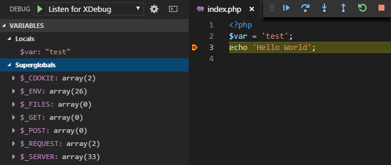

# Xdebug - Docker - VS Code
This guide assumes that you have managed to set up your php/apache docker container with Xdebug, so we are just going to concentrate on how to configure the IDE (VS Code) and PHP settings for the docker container.

## Introduction
One of the most powerful ways to debug your code is using a graphical interface that can intercept your code in a run-time environment. Some things that it will help you to do more efficiently include:

-   conditional/line/function/error type breakpoints
-   console logging (handy for debugging on live server)
-   step through your code (in/out/over)
-   inspect variables and data structures
-   watch variables as they change
-   call stack trace
-   evaluate expressions
-   profiler to optimize code efficiency
-   file ignore list to exclude from debug

## Setup

### php.ini
Add the following *Xdebug extension* settings to the `php.ini` file for your docker container.
```
xdebug.remote_enable = 1
xdebug.remote_autostart = 1
xdebug.remote_host = host.docker.internal
```
**Start up** your docker webserver container and verify the Xdebug settings from `phpinfo()` output in your web browser.

### Visual Studio Code
If you've not already done so, install the [PHP Debug](https://github.com/felixfbecker/vscode-php-debug) extension for VSCode.

Click the *Debug* extension button (looks like bug!) on the Activity bar on the left of the IDE. The sidebar should pop open with its own toolbar at the top.

You'll want to select *Listen for XDebug* in the dropdown box beside the green play/start button, then click on the cog wheel to open `launch.json` settings.
```
"version": "0.2.0",
"configurations": [
  {
    "name": "Listen for XDebug",
    "type": "php",
    "request": "launch",
    "port": 9000,
    "pathMappings": {
      "/var/www/html": "${workspaceFolder}"
    }
  },
  {
    ...
  }
]
```
These settings are typical defaults, but you might need to change are the *port* number or *pathMappings*, depending on your docker web server setup.

## Let's start debugging!
With the set up now complete (and hopefully working!), open up a php file in VS Code that produces some output, for example:
```
<?php
$var = 'test';
echo 'Hello World';
```
Load up the page in your web browser and confirm the page loads and we see the output (`Hello World`).

Now go back to the IDE and hover over the margin area, left of the code editor - you should see a *dark-red* dot. Click on the dot directly left to the `echo` statement and it will turn *bright-red* to highlight an **active breakpoint**. 

Click on the *green* play button to start the debugger and reload the page in your web browser. If everything works as expected, the web browser should stay in a continuous loading state - waiting on the debugger.

Back over to the IDE, we should see the line *highlighted* where we created the breakpoint. In the Debug sidebar,  the variables section should now be populated.



## Reference
https://xdebug.org/
https://github.com/felixfbecker/vscode-php-debug

